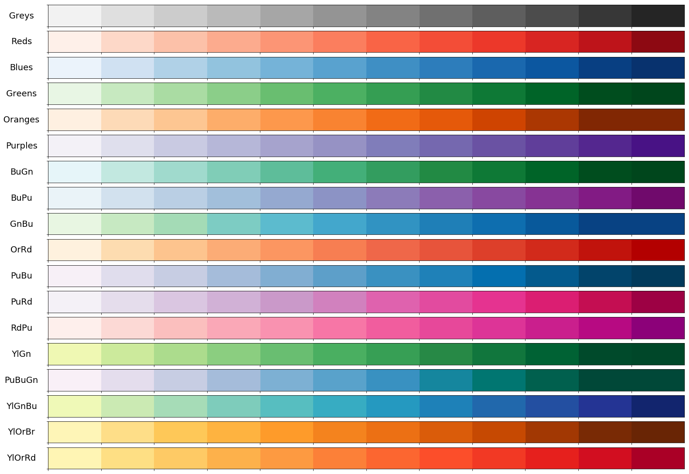
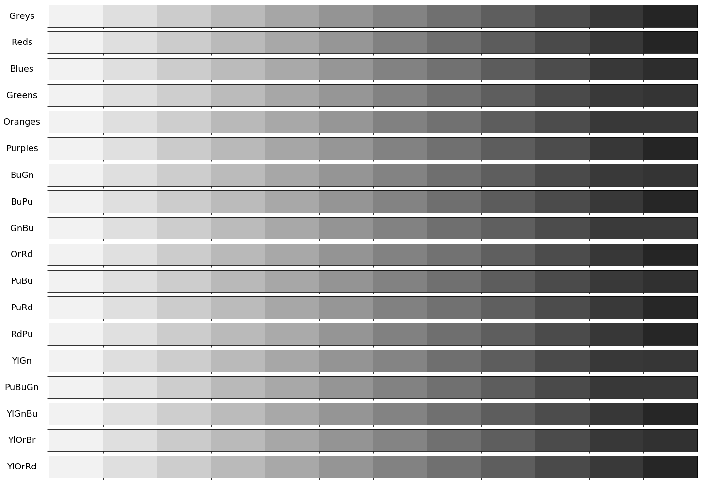
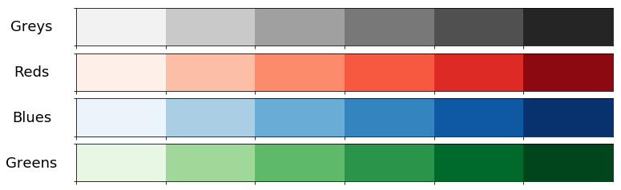

# Scientific color palette

Sometimes, we need a color palette with various colors which are distinguishable when printed in grayscale.
This repository is to provide sequential color palettes that are also distinguishable in grayscale.

## Getting Started

### Prerequisites

- Python version >= 3.6
- numpy, matplotlib, seaborn, pandas required

### Running the code

You may change options listed below for different outputs.

- n (number of colors to show for each palette)
- palette_list (list of palette names to show. Note that the full list of available palette is also provided in the code.)
- show_text (whether to show (R,G,B) text on each color or not)
- show_grayscale (whether to show result figure in grayscale or not)

## Output examples
We provide some examplary outputs.

### n=12, all palette

### n=12, all palette, grayscale

### n=6, \['Greys', 'Reds', 'Blues', 'Greens'\]

### n=6, \[\'Greys\', \'Reds\', \'Blues\', \'Greens\'\]

